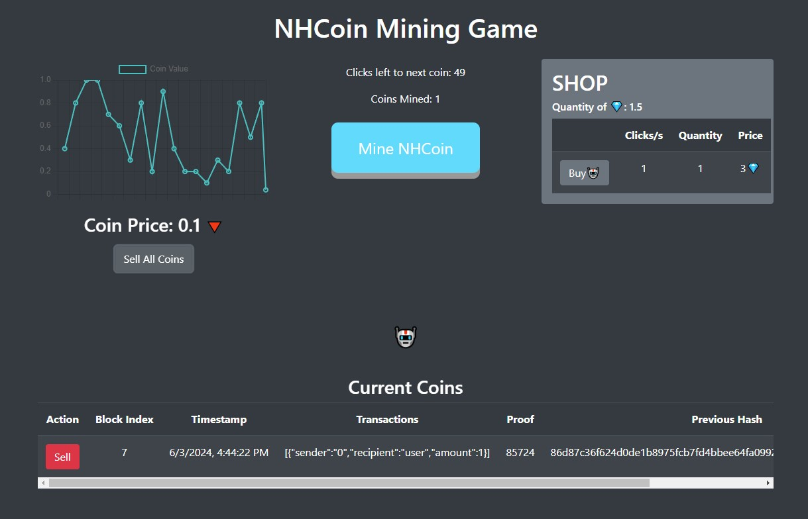

# NHCoin Mining Game

## Overview

Welcome to the NHCoin Mining Game! This project is a fun, interactive game that combines the addictive nature of clicker games with the concept of mining cryptocurrency using a simple blockchain. Players can mine NHCoin by clicking a button, sell the mined coins for gems, and purchase helpers to automate the mining process.

## Features

- **Mining NHCoin:** Click the "Mine NHCoin" button to mine coins.
- **Blockchain Integration:** Each mined coin is added to a blockchain, ensuring unique and verifiable transactions.
- **Coin Price Fluctuation:** The price of NHCoin fluctuates randomly between 0.1 and 1.0, displayed on a graph.
- **Selling Coins:** Sell mined coins for gems based on the current coin price.
- **Buying Helpers:** Use gems to purchase helpers that automate the mining process.
- **Dynamic UI:** The game interface updates in real-time, including animations and price arrows to indicate coin value changes.

## Technologies Used

- **HTML5 & CSS3:** For structuring and styling the web application.
- **Bootstrap 4:** To create a responsive and visually appealing layout.
- **JavaScript:** For game logic and interactivity.
- **Chart.js:** To display the coin price fluctuations in a graph.
- **Crypto-JS:** For hashing and cryptographic functions to simulate a blockchain.
- **Blockchain.js & Game.js:** Custom JavaScript files to handle the blockchain and game functionalities.

## Getting Started

### Prerequisites

- A modern web browser (Chrome, Firefox, Edge, etc.)

### Installation

1. Clone the repository:

```sh
git clone https://github.com/nhunter0/NHCoinMiningGame.git
```

2. Navigate to the project directory:

```sh
cd NHCoinMiningGame
```

3. Open the `index.html` file in your web browser:

```sh
open index.html
```

## How It Works

### Mining NHCoin

- Click the "Mine NHCoin" button to simulate mining.
- Each click is counted, and once the required number of clicks is reached, a new coin is mined.
- The mined coin is added to the blockchain, which records the transaction details, proof of work, and previous hash.

### Blockchain Integration

- Each mined coin is recorded as a new block in the blockchain.
- The blockchain ensures the integrity and uniqueness of each mined coin.
- The blockchain implementation uses proof of work to simulate real mining processes.

### Coin Price Fluctuation

- The coin price fluctuates between 0.1 and 1.0.
- The price is updated every 2 seconds and is displayed on a graph using Chart.js.
- Arrows indicate whether the price has increased (green arrow) or decreased (red arrow).

### Selling Coins

- Players can sell their mined coins for gems by clicking the "Sell All Coins" button.
- The gem amount received is based on the current coin price.
- Sold coins are removed from the blockchain.

### Buying Helpers

- Gems can be used to buy helpers, which automate the mining process.
- Each helper mines one coin per second.
- The number of helpers and their cost in gems is displayed in the shop.

## Code Structure

- **index.html:** The main HTML file containing the structure of the game interface.
- **styles.css:** The CSS file for styling the game interface.
- **blockchain.js:** Contains the blockchain implementation and related functions.
- **game.js:** Contains the game logic and functions for mining, selling, and buying helpers.

## Screenshots



## Acknowledgments

- Inspired by classic clicker games and the concept of blockchain technology.

Feel free to fork this project, contribute, or customize it further. Happy mining!
