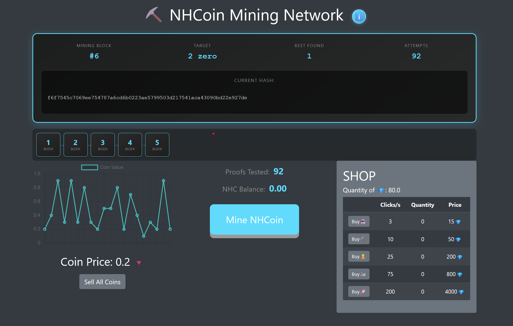

# NHCoin Mining Game

## Overview

Welcome to the NHCoin Mining Game! This project is a fun, interactive game that combines the addictive nature of clicker games with the concept of mining cryptocurrency using a simple blockchain. Players can mine NHCoin by clicking a button, sell the mined coins for gems, and purchase helpers to automate the mining process.



Try It Now! at:  [Play NHCoin Mining Game](https://nhunter0.github.io/NHCoinMiningGame/)

## Features

- **Real Blockchain Mining:** Experience actual Proof of Work mining with Blake2s hashing - the same algorithm used by Zcash!
- **Live Hash Visualization:** Watch real-time cryptographic hashes being computed with leading zeros glowing green as you search for valid blocks.
- **Smart Mining Display:** Track your mining progress with Mining Block, Target difficulty, Best Found zeros, and total Attempts - just like real miners!
- **Dynamic Difficulty Adjustment:** Difficulty automatically adjusts every 5 blocks to maintain 20-second block times, starting at 1 zero and scaling up to 7.
- **Progressive Tutorial:** Start mining easy blocks with difficulty 1, then automatically increase to minimum 2 zeros after block 6 for a smooth learning curve.
- **Block Rewards with Halving:** Earn 50 NHC per block that halves every 100 blocks - mirroring Bitcoin's economic model.
- **Beautiful Wallet Interface:** View all your mined blocks in an elegant wallet with color-coded columns, hover effects, and detailed block information.
- **Coin Price Fluctuation:** NHCoin price fluctuates randomly between 0.1 and 1.0, displayed on a live chart.
- **Selling & Economy:** Sell mined blocks for gems based on current market price and buy powerful upgrades.
- **Mining Upgrades:** Purchase helpers (🤖), miners (⛏️), engineers (👷), factories (🏭), and rockets (🚀) that auto-mine with increasing power.
- **Performance Optimized:** Smart display throttling ensures smooth performance even at high mining speeds (500+ CPS).
- **Educational Popups:** Learn about real blockchain technology with fun facts appearing every 100 coins.
- **Power-Ups:** Collect random market boosts (3x sell value) and speed boosts (1.25x click speed) that spawn periodically.

## Technologies Used

- **HTML5 & CSS3:** For structuring and styling the web application with modern animations and gradients.
- **Bootstrap 4:** To create a responsive and visually appealing layout across all devices.
- **JavaScript (ES6+):** For game logic, mining mechanics, and real-time interactivity.
- **Chart.js:** To display live coin price fluctuations in an animated graph.
- **Custom Blake2s Implementation:** Real cryptographic hash function (crypto.js) - no external crypto libraries needed!
- **Blockchain.js:** Complete blockchain implementation with Proof of Work, Merkle trees, difficulty adjustment, and frozen timestamps.
- **Game.js:** Game loop, mining logic, shop system, smart display throttling, and UI updates.

## Getting Started

### Prerequisites

- A modern web browser (Chrome, Firefox, Edge, etc.)

### Installation

1. Clone the repository:

```sh
git clone https://github.com/nhunter0/NHCoinMiningGame.git
```

2. Navigate to the project directory:

```sh
cd NHCoinMiningGame
```

3. Open the `index.html` file in your web browser:

```sh
open index.html
```

## How It Works

### Real Proof of Work Mining

- Click "Mine NHCoin" to start testing nonces (proof-of-work values) against the current difficulty target.
- Each click tests 1-8 nonces depending on your upgrades, computing actual Blake2s hashes.
- Watch the live hash display show leading zeros in green - when you find enough zeros, you mine the block!
- The "Attempts" counter shows how many nonces you've tested - this is real mining work!

### Blockchain Architecture

- **Genesis Block:** The first block (#1) with no previous hash, starting your entire blockchain.
- **Block Structure:** Each block contains index, timestamp, transactions, nonce, previous hash, difficulty, reward, and Merkle root.
- **Frozen Timestamps:** When mining starts, the timestamp freezes so the same nonce always produces the same hash (essential for distributed mining).
- **Chain Integrity:** Every block links to the previous one via cryptographic hash - changing one block invalidates the entire chain.
- **Merkle Trees:** Transaction hashes are organized in a Merkle tree structure, just like Bitcoin and Ethereum.

### Dynamic Difficulty System

- **Progressive Start:** Begin at difficulty 1 (one leading zero) for easy onboarding.
- **Automatic Scaling:** After block 6, minimum difficulty jumps to 2 to maintain challenge.
- **Smart Adjustments:** Every 5 blocks, difficulty adjusts based on actual mining times:
  - Blocks too fast (<75% of target)? Difficulty increases by 1.
  - Blocks too slow (>150% of target)? Difficulty decreases by 1.
  - Blocks very slow (>250% of target)? Difficulty decreases by 2.
- **Target Time:** 20 seconds per block to balance gameplay and learning.
- **Range:** Difficulty scales from 1 to 7 leading zeros (exponentially harder!).

### Mining Visualization

The mining header shows four key stats updated in real-time:
- **Mining Block:** Which block number you're currently working on.
- **Target:** How many leading zeros required (your difficulty goal).
- **Best Found:** Most leading zeros you've discovered so far this block.
- **Attempts:** Total nonces tested for the current block.

Below that, the live hash display shows:
- **Green Glowing Zeros:** Leading zeros light up in green with a pulsing animation.
- **Remaining Hash:** The rest of the 64-character Blake2s hash in white.
- **Success Flash:** When you find a valid block, the entire display flashes green!

### Smart Performance Optimization

- **Adaptive Throttling:** Display updates adjust based on your mining speed:
  - 0-50 CPS: Update every attempt (full detail)
  - 50-100 CPS: Update every 10 attempts
  - 100-200 CPS: Update every 25 attempts
  - 200-500 CPS: Update every 50 attempts
  - 500+ CPS: Update every 100 attempts (maximum performance)
- **Always Computed:** Every hash is still calculated even when not displayed - no shortcuts!
- **Zero Priority:** Updates always trigger when leading zeros are found, regardless of throttling.

### Block Rewards & Economics

- **Starting Reward:** 50 NHC per block (same as early Bitcoin!)
- **Halving Events:** Every 100 blocks, rewards halve (50 → 25 → 12.5 → 6.25...).
- **Total Supply:** View cumulative NHC supply in the wallet section.
- **Wallet Display:** Beautiful table showing all your mined blocks with block number, reward, timestamp, transactions, nonce, and hash.
- **Click to Explore:** Click any block in the compact visualization to see full details including Merkle root and fun facts.

### Market & Selling

- **Dynamic Pricing:** NHCoin price fluctuates between 0.1 and 1.0 gems every 2 seconds.
- **Live Chart:** Chart.js graph shows price history with green/red arrows indicating trends.
- **Sell Blocks:** Click "Sell" on individual blocks or "Sell All Coins" to convert NHC to gems.
- **Market Powerups:** Collect 💎 powerups for 3x sell value (15 seconds).

### Mining Upgrades

Use gems to purchase automated miners that work 24/7:
- **🤖 Helper:** 3 CPS, starts at 15 gems (scales 1.15x per purchase)
- **⛏️ Miner:** 10 CPS, starts at 50 gems
- **👷 Engineer:** 25 CPS, starts at 200 gems
- **🏭 Factory:** 75 CPS, starts at 800 gems
- **🚀 Rocket:** 200 CPS, starts at 4000 gems

Each upgrade also increases nonces tested per click (up to 8x bonus)!

### Power-Ups

Random power-ups spawn every 60 seconds:
- **💎 Market Boost:** 3x sell value for 15 seconds (+ golden price glow).
- **⚡ Speed Boost:** 1.25x click speed for 15 seconds (+ bonus automated mining).

## Code Structure

- **index.html:** Main HTML structure with mining visualization, wallet display, shop panel, and blockchain compact view.
- **styles.css:** Complete styling including mining header animations, wallet gradients, hash glow effects, and responsive layouts.
- **crypto.js:** Full Blake2s-256 cryptographic hash implementation (Zcash-style) with G mixing function, compression, and proper little-endian encoding.
- **blockchain.js:** Core blockchain with genesis block creation, Merkle root calculation, difficulty adjustment, block rewards with halving, and frozen timestamp mining.
- **game.js:** Game loop, onClick mining logic, smart display throttling, shop functions, powerup system, blockchain visualization, and educational popup facts.

## Educational Value

This game teaches real blockchain concepts:
- **Cryptographic Hashing:** See actual Blake2s hash computation in action.
- **Proof of Work:** Experience the computational challenge of finding valid hashes.
- **Difficulty Adjustment:** Learn how blockchains maintain consistent block times.
- **Economic Models:** Understand block rewards, halving events, and supply limits.
- **Chain Structure:** Visualize how blocks link together via cryptographic hashes.
- **Merkle Trees:** Explore transaction verification used by Bitcoin and Ethereum.
- **Frozen Timestamps:** Discover why miners freeze timestamps during mining sessions.

## Acknowledgments

- Inspired by classic clicker games (Cookie Clicker, Universal Paperclips) and real blockchain technology.
- Blake2s algorithm based on the Zcash and Nano cryptocurrency implementations.
- Educational approach designed to make complex cryptography accessible and fun.

Feel free to fork this project, contribute, or customize it further. Happy mining! ⛏️
